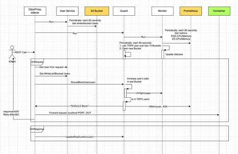
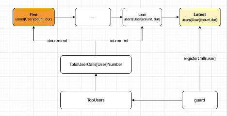

# Introduction

There are many DDOS Guard solutions on the market to protect RESTAPI services. 
The major part of the existing solutions is based on the user's rate limit. 
We have numerous groups of internal users (and faceless accounts) which use the services. It's a nightmare to manage
the rate limits of all categories of users: 

- What is the "right" quota for today?
- Use rate limit for day/hour/minute/second time interval?
- By user only or per API or service?
- How manage all this stuff? xsl? UI?

Our approach is to detect that the system is under stress (high CPU or memory usage of the pods)
and at the first step scale up the compute resources (aka pods count). But, usually, services use some Database or any other 
external resources which became the bottleneck in the case of pods scale-up. Therefore, we have to monitor also the external resources
(like Database, Queue Broker, etc) to really protect the service against the DDOS attack. 

Our DDOS guard is implemented as k8s side container. It provides standalone protection for the underlying container.
When the metrics of the service look fine, the DDOS guard receives requests, manages users' statistics, and forwards the request to the pod.
But, when the "pod is under stress" - the DDOS guard should start filtering requests from the TopN heavy users to protect the pod.
The requests from regular users will continue to be served. But the portion (dynamically calculated) of requests of the heavy ones 
will be rejected by our DDOS guard (the REST client has to use "Retry-After" response header to retry the request). 

The guard can use *Prometheus* and *CloudWatch* services to monitor the pod's resources (cpu/memory etc) and other cluster services 
and resources.

Actually, the current implementation allows putting the DDOS guard before the service itself (not as a side container). It will listen for requests on the input port and forwards them to the configurable output hostname and port.

# Implementation

Our implementation is based on [goproxy](https://github.com/elazarl/goproxy) package. 

The basic flow can be described as the following:

- Get HTTP request
- Extract the user from the JWT token (we don't validate it). If the system is under attack and the user is in the TopN user list - return 429
- Update the user call statistics: call count and duration
- The DDOS guard support *white* and *blocked* user lists, which can be defined as part of the configuration or in S3 bucket 
(the file from S3 is refreshed according to the configuration interval).
- The TopN users are calculated based on two measurements: calls count and duration. The user's statistics are stored
in the time bucket. The bucket duration and history size are defined in the configuration file. The TopN users calculation 
process is running in the background thread and is not a part of the request/response process.
- The background thread is periodically monitoring the resources (Prometheus and CloudWatch queries) of the protected container.
In case, one of them is greater than *UpperBound* value (specified by the configuration) the guard should start to filter
upcoming requests. (Note: if for any reason the query can't be executed, the monitor does not take it into account).
Only TopN users' requests will be filtered on the stress. The guard will begin with filtering 10% of the requests. 
If this will not help, the filtering will be increased to 20%, 30%, and so on. And otherwise, the filter ratio will be
decreased by 10% each time, in case the system behavior is back to normal.


## Component
### Proxy
The main entry of the DDOS guard. It listens for requests on *PortIn* port and forwards them to the *PortIn* underlying container port.
The guard exposes two own endpoints:
- health - the DDOS guard health check
- metrics - Prometheus metrics endpoint (see Collector)
It uses the Guard component to get TopN users for filtering in case "the system is under stress".



### Guard
The *Guard* manages the users' statistics to provide the TopN users list to the *Proxy*. The statistics are stored in time-based buckets.
The background thread, once a time, removes the oldest bucket (according to the configuration) and re-calculates the TopN users list.
Thus, the TopN users list is always available for the proxy and no additional effort spends on the incoming request processing.



### Monitor
Periodically runs in the background thread the provided Prometheus and CloudWatch queries to validate the healthy status of the system.
In case, one of the query's values is greater than *UpperBound* - the *InHighUsage* flag is raised.

### Collector
The DDOS guard exposes the following Prometheus metrics:
- Counter *ddos_user_blocked* - blocked users by the guard
- Gauge *ddos_guard_status* - DDOS guard status, 0 - Ok, otherwise the index of the query for the "stress" reason

### UserService
Manage *white* and *blocked* user lists. If the users are defined in S3 bucket - pool the changes according to the *UserService.RefreshPeriod*
configuration value.

## Configuration
The DDOS guard configuration file should be placed under `/etc/ddos-guard/ddos-guard.json` inside the container. 

### Proxy section
```json
{
    "Proxy": {
        "PortIn": 8081,
        "PortOut": 8080,
        "HostOut": "localhost",
        "RetryAfter": 60,
        "HealthPath": "/ddos-guard-health",
        "MetricsPath": "/ddos-guard-metrics"
    }
}
```

### UserService section
Provides configuration to manage *white* and *blocked* user lists. The lists can be provided as a part of the configuration,
or pooled periodically from S3 bucket. The AWS [enviroment variables](https://docs.aws.amazon.com/cli/latest/userguide/cli-configure-envvars.html) 
or `ServiceAccount` can be used to provide access to S3 bucket,

```json
{
    "UserService": {
        "RefreshPeriod": "60s",
        "WhiteListUsers": [],
        "BlockedListUsers": [],
        "S3Bucket": "my-bucket",
        "S3Path": "ddos/users.json"
    }
}
```

Sample of `users.json`:
```json
{
    "WhiteListUsers": [
        "test1_white",
        "test2_white"
    ],
    "BlockedListUsers": [
        "test_blocked"
    ]
}
```

### Monitoring section
Defines Prometheus and CloudWatch queries to identify the "system under the stress" case.
You can use environment variables inside the query. For example, you can use `${MY_POD_NAME}` k8s Pod's name to
parametrize query to get the container's CPU and Memory usage:

```yaml
    env:
    - name: MY_POD_NAME
        valueFrom:
        fieldRef:
            apiVersion: v1
            fieldPath: metadata.name
```

```json
{
    "Monitoring": {
        "MetricsPeriodSeconds": 30,
        "PrometheusQueries": {
            "ElasticCPU": {
                "Query": "sum(elasticsearch_process_cpu_percent{job='elasticsearch-metrics',cluster='elastic',name=~'elasticsearch-data-.*'} ) / count (elasticsearch_process_cpu_percent{job='elasticsearch-metrics',cluster='elastic',name=~'elasticsearch-data-.*'})",
                "UpperBound": 90.0
            },
            "ElasticMemory": {
                "Query": "sum(elasticsearch_jvm_memory_used_bytes{job='elasticsearch-metrics',cluster='elastic',name=~'elasticsearch-data-.*'}) / sum (elasticsearch_jvm_memory_max_bytes{job='elasticsearch-metrics',cluster='elastic',name=~'elasticsearch-data-.*'}) * 100",
                "UpperBound": 90.0
            },
            "PodCPU": {
                "Query": "avg(node_namespace_pod_container:container_cpu_usage_seconds_total:sum_irate{pod='${MY_POD_NAME}'}) / avg(cluster:namespace:pod_cpu:active:kube_pod_container_resource_limits{pod='${MY_POD_NAME}'}) * 100",
                "UpperBound": 90.0
            },
            "PodMemory": {
                "Query": "avg(container_memory_working_set_bytes{job='kubelet', metrics_path='/metrics/cadvisor', pod='${MY_POD_NAME}', container!='', image!=''}) / avg(cluster:namespace:pod_memory:active:kube_pod_container_resource_limits{pod='${MY_POD_NAME}'}) * 100",
                "UpperBound": 90.0
            },
            "RequestDuration": {
                "Query": "sum(increase(gonic_request_duration_sum{pod='${MY_POD_NAME}'}[1m])) / sum(increase(gonic_request_duration_count{pod='${MY_POD_NAME}'}[1m]))",
                "UpperBound": 10.0
            }
        },
        "CloudWatchQueries": {
            "RDSCPU": {
                "Namespace": "AWS/RDS",
                "Metric": "CPUUtilization",
                "DimensionName": "DBInstanceIdentifier",
                "DimensionValue": "prd-mysql8",
                "UpperBound": 90.0
            }
        }
    }
}
```

### Guard section
Provides configuration for *Guard* component to manage user's statistic buckets and TopN user lists.

```json
{
    "Guard": {
        "BucketDuration": "60s",
        "BucketsHistory": 10,
        "TopUserCount": 3,
        "FilterRatioStep": 10
    }
}
```

### Prometheus section (Optional)
Provides Prometheus server address and credentials (just omit 8Username* in case yous Prometheus does not have authentication).
If your Prometheus runs inside the k8s cluster, you can provide the internal one: `http://kube-prometheus-stack-prometheus.kube-prometheus-stack.svc.cluster.local:9090`

```json
{
    "Prometheus": {
        "Url": "http://prometheus.my.com",
        "Username": "user",
        "Password": "psw"
    }
}
```

## Environment variables
You can override the configuration from the `ddos-guard.json` file using the following environment variables:

```bash
PORT_IN="8081"
HOST_OUT="localhost"
PORT_OUT="8080"
RETRY_AFTER="60"
MY_POD_NAME="pod-1234"
BYPASS="false"
```

`BYPASS` provides the fast solution to skip DDOS guard proxy mechanism in case of unexpected behavior or bugs.

## Deployment
You can find the latest docker image of the DDOS guard in [Docker Hub](https://hub.docker.com/repository/docker/yukels97/ddos-guard)
repository. The [Dockerfile](ddos-guard/Dockerfile) based on *Alpine Linux* image and was compiled for two platforms: Mac and Linux
(linux/amd64, linux/arm64).

You can find under the [deploy](test/deploy) folder sample of deployment to AWS kubernetes cluster. 
> **_NOTE:_**  If you are using k8s HPA, you should specify the value of *targetCPUUtilizationPercentage* smaller than
the *UpperBound* value of *PodCPU* query (in th example 80 and 90, respectively).


